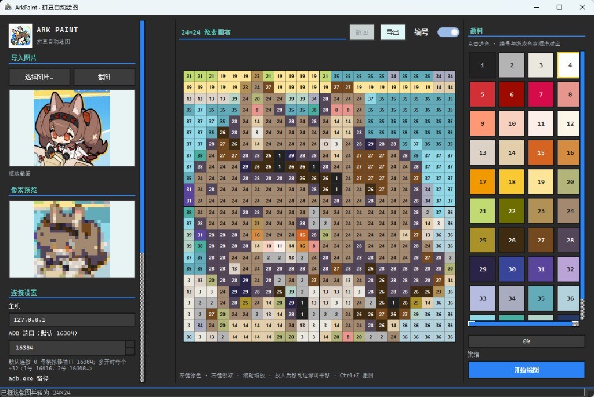

# ArkPaint · 拼豆自动绘图

ArkPaint 是一款面向 **MuMu 模拟器** 的 Windows 桌面工具：把任意图片转成游戏可用的 **24×24 像素稿**，再通过 **ADB** 在拼豆编辑页自动选色、填格。

仓库：[https://github.com/Kita164/ArkPaint](https://github.com/Kita164/ArkPaint)



---

## 快速开始

| 你是… | 怎么做 |
|--------|--------|
| **普通用户** | 到 [Releases](https://github.com/Kita164/ArkPaint/releases) 下载 `ArkPaint-windows-x64.zip`，解压后运行 `ArkPaint.exe` |
| **开发者** | 克隆仓库 → 创建虚拟环境 → 安装依赖 → `python main.py`（见 [开发运行](#开发运行)） |

MuMu 12 常见 ADB 地址：`127.0.0.1:16384`（多开每实例端口 **+32**：16416、16448…）。

---

## 功能概览

| 模块 | 能力 |
|------|------|
| **素材导入** | 本地图片、拖放、屏幕框选截图 |
| **像素转换** | 三种算法映射到游戏固定 **40 色**色盘 |
| **手动编辑** | 涂色、吸取、撤回、滚轮缩放、边缘平移 |
| **对照预览** | 原图与像素效果并排缩略图 |
| **ADB 连接** | 内置 `adb.exe`，自动检测端口与多开实例 |
| **自动识别** | 截图识别中央画布与右侧颜料栏（分辨率自适应） |
| **颜料栏对齐** | 绘制前自动把游戏色板滚到顶部并与程序色盘对齐 |
| **智能滚动** | 1–24 号在顶部视口绘制；25–40 号自动滚到底部继续 |
| **自动绘制** | 按颜色分组填格，实时进度与当前色号高亮 |
| **诊断调试** | 逐步检查 ADB → 截图 → 画布 → 色板，输出调试图 |
| **导出** | 放大后的像素成品图（PNG / JPEG） |

---

## 界面布局

```
┌─────────────┬──────────────────────┬─────────────┐
│ 左侧        │ 中间画板              │ 右侧        │
│ 导入 / 截图 │ 24×24 像素画布        │ 颜料色盘    │
│ 原图预览    │ 撤回 / 导出 / 编号    │ 进度条      │
│ 像素预览    │ 滚轮缩放 · 边缘平移   │ 开始 / 停止 │
│ ADB 连接    │                      │             │
│ 绘制参数    │                      │             │
└─────────────┴──────────────────────┴─────────────┘
```

### 左侧：素材与连接

- **导入图片**：选择文件，或将图片拖入预览区；随后拖动正方形框选定 1:1 转化区域
- **截图**：隐藏本窗口后在屏幕上框选区域，再拖动正方形框精选并转为像素图
- **转换算法**（均只使用游戏约 40 色，不会发明新色；切换后若已有素材会立即重转，可撤回）
  - **标准 · RGB 最近邻**：区域平均缩小 + RGB 距离，色块干净，适合图标 / 平涂
  - **感知 · Lab 色差**：Lab 感知色差选色，肤色、灰阶通常更准
  - **抖动 · Floyd–Steinberg**：误差扩散，照片 / 渐变更有层次（24×24 会略噪）
- **原图 / 像素预览**：对照查看转化效果
- **连接设置**
  - 主机、ADB 端口、自定义 `adb.exe` 路径
  - **自动检测** / **连接模拟器**（会扫描常见 MuMu 多开端口）
- **绘制参数**：识别置信度、点击间隔、是否跳过白色格
- **诊断识别**：逐步检查识别链路；失败时保存截图与标注到 `data/debug/`

### 中间：像素画板

- 左键涂色、右键吸取、拖拽连续填色
- **撤回**（`Ctrl+Z`）：按笔划撤销
- **导出**：输出放大像素图（默认约 768×768）
- **编号**开关：控制格子与色盘上的色号显示
- **滚轮缩放**：默认铺满为最小；放大后鼠标移到边缘自动平移

### 右侧：色盘与绘制

- 点击色盘选手动涂色；自动绘制时高亮当前色号
- **开始绘图 / 停止**：自动识别坐标 → 对齐颜料栏 → 按色填格

---

## 推荐使用流程

### 1. 准备像素稿

导入图片或截图 → 选择转换算法 → 拖动正方形框选区 → 在画布上微调 → 可选「导出」备份

### 2. 连接模拟器

打开 MuMu → 程序内点「自动检测」或「连接模拟器」

### 3. 开始绘图

1. 在游戏中打开 **拼豆编辑页**（中央 24×24 白色网格 + 右侧颜料栏）
2. 点「开始绘图」
3. 程序会自动：
   - 截图识别画布与颜料栏坐标
   - 将游戏颜料栏 **滚回顶部**（比对前 4 色：黑 / 灰 / 浅灰 / 白）
   - 按颜色分组，依次选色并在画布上点击填格
4. 中途可点「停止」取消

> 每次「开始绘图」都会按默认配置自动连接（若尚未连接），并重新识别画布与色板。  
> 识别失败时可点「诊断识别」查看截图与步骤。

---

## 自动绘制：颜料栏逻辑

程序内置 **固定 40 色色盘**（顺序与游戏一致，见 `data/palette_from_game.json`），**不会**用游戏当前截图覆盖色盘顺序。

游戏右侧颜料栏 UI 一次只完整展示 **4 列 × 6 行 = 24 个色块**，其余需滚动。ArkPaint 按两档区域处理：

| 色号范围 | 颜料栏位置 | 程序行为 |
|----------|------------|----------|
| **1–24** | 顶部视口 | 绘制前滚到顶部；选色时保持顶部 |
| **25–40** | 底部视口（约 17–40 可见） | 首次需要时 **连续上滑约 4 次** 滚到底，再点击对应槽位 |

**绘制前对齐**（无论游戏色板当前停在哪）：

1. 截图采样最上一行 4 个色块
2. 与程序色号 1–4 比对
3. 不一致则从上往下滑动（最多约 4 次）直到对齐
4. 等待约 0.5s 让游戏滚动动画结束

**坐标计算**：自动校准时记录第 1 号色中心 `(ox, oy)` 与行列间距 `(dx, dy)`。滚到底部后视口顶部对应色盘第 5 行（17 号起），例如 25 号落在可见区域第 3 行第 1 列，点击 `(ox, oy + 2×dy)`。

点击坐标会限制在画布矩形与可见颜料网格内，避免误点 UI 空白或滚动箭头。

---

## 打包分发

```bat
build_exe.bat
```

产物目录：

```
dist/arkpaint/
  ArkPaint.exe
  tools/
    adb.exe
    AdbWinApi.dll
    AdbWinUsbApi.dll
```

将整个 `dist/arkpaint/` 文件夹分发给用户即可。

---

## 开发运行

环境：**Python 3.10+**（推荐 3.13）

```powershell
git clone https://github.com/Kita164/ArkPaint.git
cd ArkPaint

# 创建虚拟环境（只需一次）
python -m venv .venv313

# 激活（Windows PowerShell）
.venv313\Scripts\activate

# 安装依赖
pip install -r requirements.txt

# 启动
python main.py
```

不激活虚拟环境时也可直接：

```powershell
.venv313\Scripts\python.exe main.py
```

主要依赖：`PySide6`、`Pillow`、`numpy`、`opencv-python-headless`、`pyinstaller`。

### 识别回归测试

使用 `data/1-24.jpg`、`data/16-40.jpg` 等游戏参考截图，无需连接模拟器：

```powershell
.venv313\Scripts\python.exe tools\test_detect_screenshots.py
```

结果写入 `data/detect_test/`（标注图、`report.json`）。

### 色盘采样（维护用）

从参考截图重新生成 `data/palette_from_game.json`：

```powershell
.venv313\Scripts\python.exe tools\sample_palette_from_shots.py
```

---

## 项目结构

```
arkpaint/
  core/
    adb.py              # ADB 连接、截图、点击、滑动
    auto_calibrate.py   # 自动识别画布与颜料栏
    calibration.py      # 校准数据与坐标计算
    detector.py         # 拼豆编辑页检测
    diagnose.py         # 诊断识别流程
    image_processor.py  # 图片量化与三种转换算法
    palette.py          # 固定 40 色色盘
    palette_align.py    # 颜料栏对齐与底部视口计算
    painter.py          # 自动绘制编排（对齐、滚动、选色、填格）
  ui/                   # 主窗口、画布、色盘、诊断对话框、主题
assets/                 # Logo、界面截图等资源
data/                   # 运行时数据（不提交 Git）
tools/                  # adb、识别测试与色盘采样脚本
main.py                 # 程序入口
requirements.txt
ArkPaint.spec
build_exe.bat
```

---

## 数据目录 `data/`

| 路径 | 用途 |
|------|------|
| `settings.json` | ADB 主机、端口、点击间隔等用户设置 |
| `calibration.json` | 画布与颜料栏校准坐标 |
| `palette_from_game.json` | 固化 40 色 RGB 参考 |
| `1-24.jpg` / `16-40.jpg` / `17-40.jpg` | 游戏参考截图（识别测试、色盘采样） |
| `scratch/` | 导入缓存、采样中间图 |
| `detect_test/` | `test_detect_screenshots.py` 输出 |
| `debug/` | 诊断识别调试图 |

---

## 说明与限制

- 色盘为游戏固定约 **40 色**，编号 1 起按左→右、上→下排列；默认跳过白色格（色号 4）以减少无效点击。
- 自动绘制依赖稳定的拼豆编辑界面布局；游戏 UI 大改时可能需更新识别逻辑。
- 本工具通过 ADB 模拟点击，请在自有账号与合规场景下使用。
- GitHub 托管源码；可执行文件请通过 Releases 或本地 `build_exe.bat` 获取。

---

## License

项目代码以仓库内实际声明为准；若未单独声明，仅供学习与个人使用。
